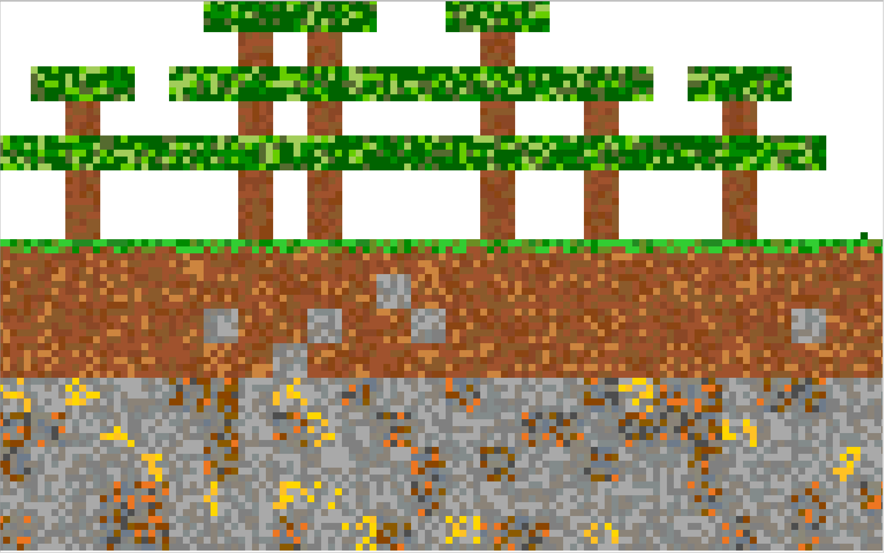
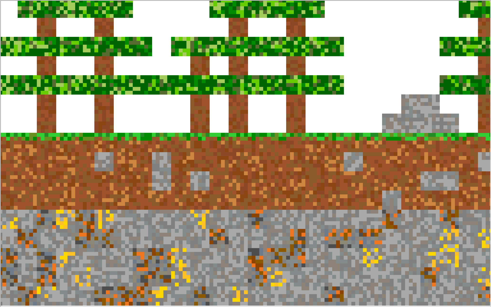
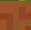

# 2D-World-Generator

__Welcome to my project 2D world generator!__

__Important information:__

This project is only tested on __Ubuntu Linux 24.04 LTS__! It may not work on Windows or Mac. If it doesn't work just make a vm.
To run this, you should download the project by doing 
```
git clone https://github.com/Ligerbot/2D-World-Generator 
cd 2D-World-Generator/ 
./Setup 
```
This should download and install the dependencies.

__Warning!!!__ Turn your volume down when starting the game, because
it plays loud bass-boosted music.




__Leaves__


__Log__



__Grass__


__Dirt__


__Stone__


__Copper__


__Gold__


